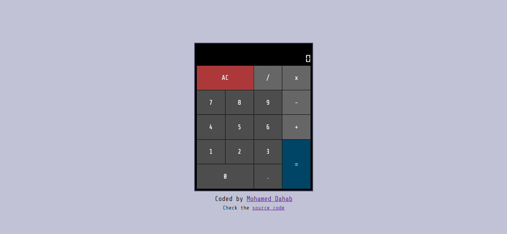
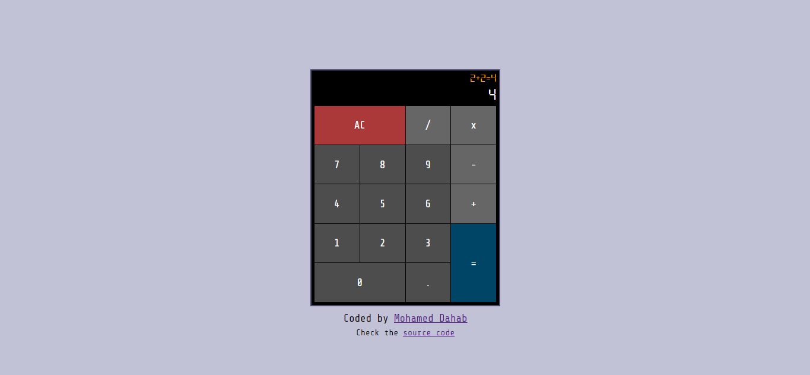

# Calculator with React

A simple calculator built with React + Vite and CSS. 

## Project Screen Shot(s)

## Reflection
This is my first project to do all by myself after learning React. It's not too complicated, although there were some parts related to logic that were a little annoying to figure out.

This is made as a clone of freeCodeCamp's [JavaScript Calculator project](https://www.freecodecamp.org/learn/front-end-development-libraries/front-end-development-libraries-projects/build-a-javascript-calculator). I wanted something to practice the React stuff I learnt and thought their project would be great as they would give me a clear target to work toward, instead of trying think of and design an idea of mine. 

This took me around 7-8 hours of work over the span of 2 days.
